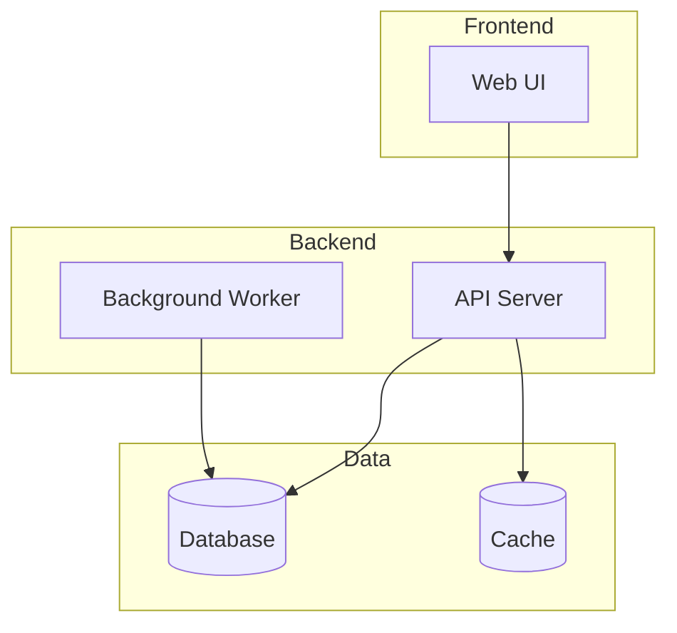
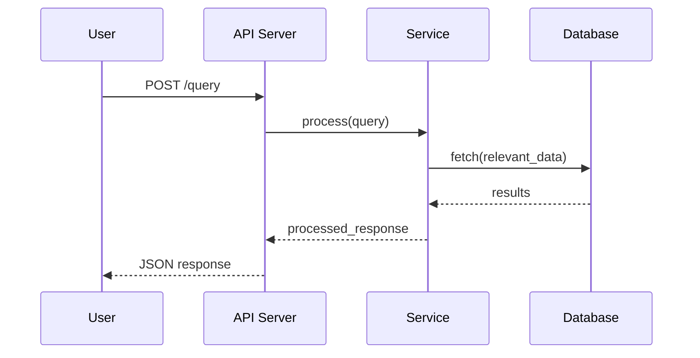

# CODEWIKI_GUIDE.md — Codebase Wiki Generator

> Inspired by [Google CodeWiki](https://codewiki.google). Every project we build gets a comprehensive, structured wiki documenting its architecture, modules, and usage.

## When to Generate

- **After every project is built** (spawn `docs` agent automatically)
- **After major refactors** (regenerate affected sections)
- **On request** ("generate code wiki for X")

## Output Structure

For every project, generate a `docs/wiki/` directory:

```
docs/wiki/
├── README.md              # Wiki home — project overview + navigation
├── ARCHITECTURE.md        # System architecture + diagrams
├── MODULES.md             # Module-by-module deep dive
├── API_REFERENCE.md       # All endpoints/functions/classes
├── DATA_FLOW.md           # How data moves through the system
├── SETUP.md               # Dev environment + deployment
├── CONFIGURATION.md       # All config options explained
├── DEPENDENCIES.md        # External deps + why each is used
└── diagrams/
    ├── architecture.mmd   # Mermaid architecture diagram
    ├── data-flow.mmd      # Mermaid data flow diagram
    ├── class-diagram.mmd  # Mermaid class/component diagram
    └── sequence.mmd       # Mermaid sequence diagrams
```

## Document Templates

### README.md (Wiki Home)

```markdown
# [Project Name] — Code Wiki

> Auto-generated codebase documentation

## Overview
[1-2 paragraph summary: what it does, why it exists, key design decisions]

## Tech Stack
| Layer | Technology | Purpose |
|-------|-----------|---------|
| Frontend | ... | ... |
| Backend | ... | ... |
| Database | ... | ... |
| Infrastructure | ... | ... |

## Quick Navigation
- [Architecture](ARCHITECTURE.md) — System design & component relationships
- [Modules](MODULES.md) — Deep dive into each module
- [API Reference](API_REFERENCE.md) — Endpoints, functions, classes
- [Data Flow](DATA_FLOW.md) — How data moves through the system
- [Setup](SETUP.md) — Development & deployment guide
- [Configuration](CONFIGURATION.md) — All config options
- [Dependencies](DEPENDENCIES.md) — External libraries & rationale

## Project Stats
- **Files:** X
- **Lines of Code:** ~X,XXX
- **Languages:** Python, TypeScript, etc.
- **Last Updated:** YYYY-MM-DD
```

### ARCHITECTURE.md

```markdown
# Architecture

## High-Level Design
[Describe the overall architecture pattern: monolith, microservices, event-driven, etc.]

## Component Diagram


## Key Design Decisions
| Decision | Choice | Rationale |
|----------|--------|-----------|
| ... | ... | ... |

## Directory Structure
```
project/
├── src/           # [describe]
├── api/           # [describe]
├── models/        # [describe]
├── services/      # [describe]
├── utils/         # [describe]
└── tests/         # [describe]
```
```

### MODULES.md

For each module/directory, document:

```markdown
# Modules

## `module_name/`

**Purpose:** [What this module does]
**Entry Point:** `module_name/__init__.py` or `module_name/index.ts`

### Key Files
| File | Purpose | Key Functions/Classes |
|------|---------|----------------------|
| `file.py` | [purpose] | `ClassName`, `function_name()` |

### Internal Dependencies
- Uses `other_module.service` for [purpose]
- Depends on `config.settings` for [what]

### Example Usage
```python
from module_name import MainClass
result = MainClass().process(input_data)
```
```

### API_REFERENCE.md

```markdown
# API Reference

## Endpoints

### `POST /api/v1/resource`
**Purpose:** [What it does]
**Auth:** Required / Public

**Request:**
```json
{
  "field": "type — description"
}
```

**Response (200):**
```json
{
  "result": "type — description"
}
```

**Errors:**
| Code | Meaning |
|------|---------|
| 400 | Invalid input |
| 401 | Unauthorized |

---

## Core Classes

### `ClassName`
**Location:** `src/module/file.py:42`
**Purpose:** [What it does]

| Method | Params | Returns | Description |
|--------|--------|---------|-------------|
| `method()` | `arg: type` | `type` | [what it does] |
```

### DATA_FLOW.md

```markdown
# Data Flow

## Primary Flows

### [Flow Name] (e.g., "User Query → Response")


**Steps:**
1. User submits query via [endpoint]
2. API validates input and calls [service]
3. Service [processes/transforms] data
4. Results returned as [format]

### Error Handling Flow
[Document how errors propagate through the system]
```

## Generation Process

### Agent: `docs` (Coding Team)

When spawned with task "generate code wiki":

1. **Scan the codebase**
   - `find . -type f -name "*.py" -o -name "*.ts" -o -name "*.js" | head -100`
   - `wc -l` for stats
   - Read `README.md`, `docker-compose.yml`, config files first

2. **Map the architecture**
   - Identify entry points (main.py, app.ts, index.js)
   - Trace imports to build dependency graph
   - Identify layers (routes → services → models → DB)

3. **Generate each document**
   - Follow templates above
   - Include actual code references with file:line
   - Generate Mermaid diagrams for visual understanding

4. **Cross-link everything**
   - Every class/function reference links to its definition
   - Every module links to related modules
   - Diagrams reference actual component names

5. **Commit to repo**
   - `docs/wiki/` directory
   - Add link in main README.md

## Spawn Template

```
Generate a comprehensive Code Wiki (Google CodeWiki style) for:
Project: [path]
GitHub: [url]

Follow CODEWIKI_GUIDE.md. Scan the full codebase and produce:
1. docs/wiki/README.md — Project overview + navigation
2. docs/wiki/ARCHITECTURE.md — System design + Mermaid diagrams
3. docs/wiki/MODULES.md — Module-by-module deep dive
4. docs/wiki/API_REFERENCE.md — All endpoints/functions/classes
5. docs/wiki/DATA_FLOW.md — Data flow + sequence diagrams
6. docs/wiki/SETUP.md — Dev + deployment guide
7. docs/wiki/CONFIGURATION.md — All config options
8. docs/wiki/DEPENDENCIES.md — External deps + rationale
9. docs/wiki/diagrams/*.mmd — All Mermaid source files

Include actual file:line references. Cross-link everything.
Commit to the repo when done.
```

## Quality Checklist

- [ ] Every public function/class documented
- [ ] Architecture diagram matches actual code structure
- [ ] Data flow diagrams cover primary user journeys
- [ ] Setup instructions actually work (tested)
- [ ] All config options listed with defaults
- [ ] Dependencies listed with version + purpose
- [ ] No placeholder text — everything is specific to the project
- [ ] Mermaid diagrams render correctly
- [ ] Cross-links between documents work
