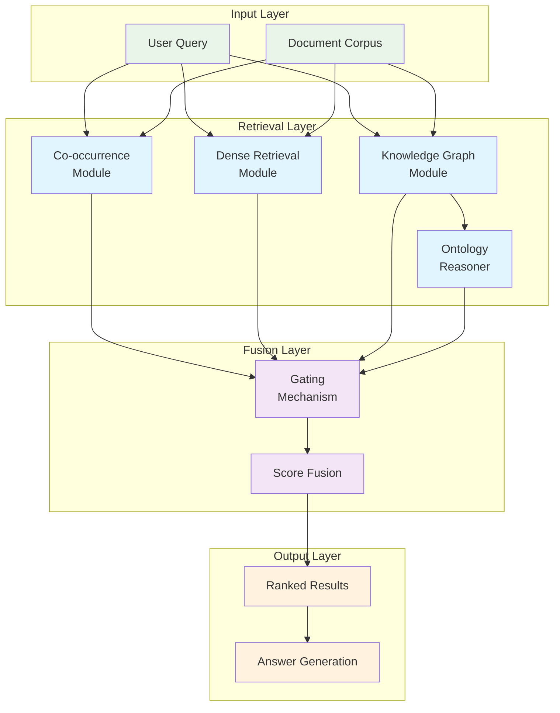
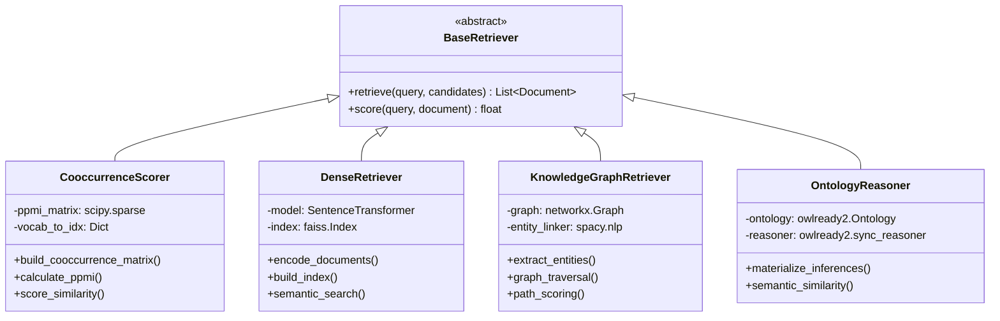
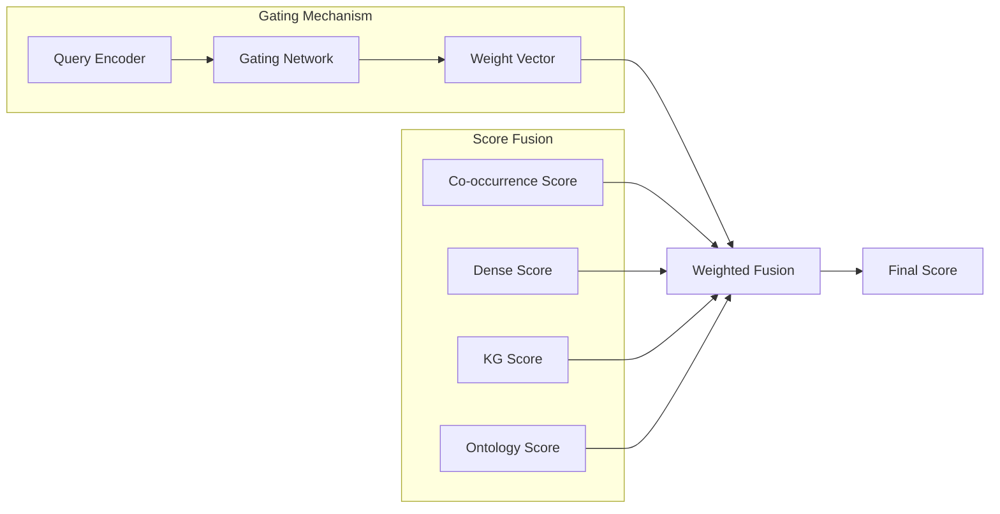
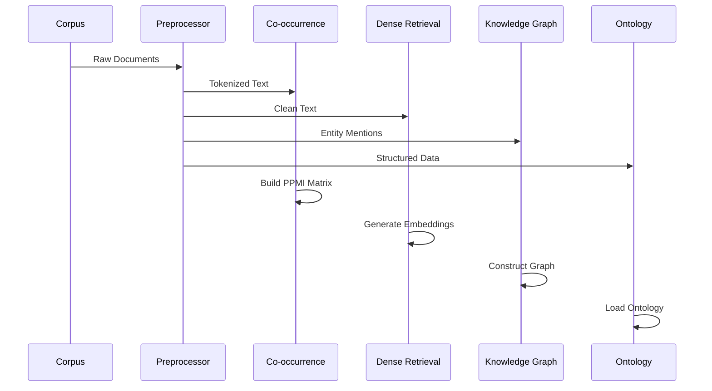
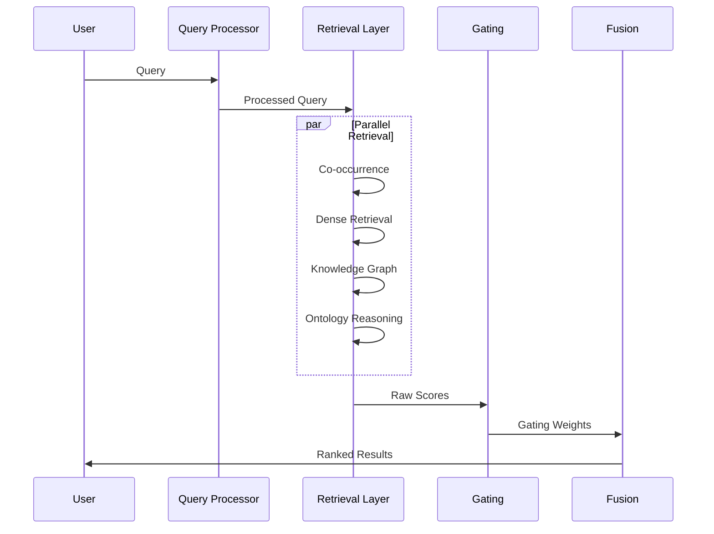

# 🏗️ System Architecture

## High-Level Overview

The RAG Second Brain implements a **multi-modal retrieval architecture** that combines statistical, dense, and symbolic approaches to information retrieval. The system follows a modular design with clear separation of concerns.



## Core Architecture Principles

### 1. **Modular Design**
- Each retrieval method is implemented as an independent module
- Clear interfaces between components via abstract base classes
- Pluggable architecture for easy experimentation

### 2. **Multi-Modal Retrieval**
```python
# src/pipeline.py:45-52
class RAGPipeline:
    def __init__(self):
        self.cooccurrence = CooccurrenceScorer()
        self.dense = DenseRetriever()
        self.kg = KnowledgeGraphRetriever()
        self.ontology = OntologyReasoner()
        self.gating = GatingMechanism()
```

### 3. **Learned Fusion**
The system uses neural gating mechanisms to dynamically weight different retrieval sources based on query characteristics.

## Component Architecture

### Retrieval Components



### Fusion Architecture



## Data Flow Architecture

### 1. **Indexing Pipeline**


### 2. **Query Processing Pipeline**


## Implementation Details

### Core Pipeline (`src/pipeline.py:324 lines`)

The main `RAGPipeline` class orchestrates all components:

```python
# src/pipeline.py:78-95
def retrieve_and_rank(self, query: str, candidates: List[str], 
                     top_k: int = 10) -> List[Tuple[str, float]]:
    """Main retrieval and ranking pipeline."""
    
    # Parallel retrieval across all modalities
    cooccur_scores = self.cooccurrence.score_candidates(query, candidates)
    dense_scores = self.dense.retrieve(query, candidates)
    kg_scores = self.kg.retrieve_with_reasoning(query, candidates)
    onto_scores = self.ontology.semantic_scoring(query, candidates)
    
    # Learned gating mechanism
    gate_weights = self.gating.compute_weights(query)
    
    # Score fusion and ranking
    final_scores = self._fuse_scores(
        [cooccur_scores, dense_scores, kg_scores, onto_scores],
        gate_weights
    )
    
    return self._rank_results(candidates, final_scores, top_k)
```

### Gating Mechanism (`src/gating.py:245 lines`)

Neural network for dynamic source weighting:

```python
# src/gating.py:67-89
class GatingNetwork(nn.Module):
    def __init__(self, input_dim: int = 384, hidden_dim: int = 128, 
                 num_sources: int = 4):
        super().__init__()
        self.query_encoder = nn.Linear(input_dim, hidden_dim)
        self.gate_network = nn.Sequential(
            nn.Linear(hidden_dim, hidden_dim),
            nn.ReLU(),
            nn.Dropout(0.1),
            nn.Linear(hidden_dim, num_sources),
            nn.Softmax(dim=-1)
        )
    
    def forward(self, query_embedding: torch.Tensor) -> torch.Tensor:
        """Compute gating weights for different retrieval sources."""
        encoded = F.relu(self.query_encoder(query_embedding))
        weights = self.gate_network(encoded)
        return weights
```

## Scalability Considerations

### Performance Optimizations
1. **FAISS Indexing** - Efficient similarity search for dense retrieval
2. **Sparse Matrix Operations** - Memory-efficient co-occurrence calculations  
3. **Graph Caching** - Pre-computed knowledge graph paths
4. **Batch Processing** - Vectorized operations where possible

### Memory Management
- Lazy loading of large matrices and indexes
- Configurable cache sizes for different components
- Optional GPU acceleration for neural components

## Web Application Architecture

```mermaid
graph TB
    subgraph "Frontend"
        UI[Web Interface]
        JS[JavaScript]
        CSS[Styling]
    end
    
    subgraph "Flask Backend"
        APP[app.py]
        API[REST APIs]
        TMPL[Templates]
    end
    
    subgraph "Processing"
        RETR[Retrieval Services]
        CORE[Core Pipeline]
    end
    
    UI --> APP
    JS --> API
    APP --> RETR
    RETR --> CORE
    
    classDef frontend fill:#e3f2fd
    classDef backend fill:#f1f8e9
    classDef processing fill:#fff8e1
    
    class UI,JS,CSS frontend
    class APP,API,TMPL backend  
    class RETR,CORE processing
```

### Flask Application Structure (`app/`)
- `app.py` - Main Flask application (200+ lines)
- `templates/` - Jinja2 HTML templates
- `static/` - CSS styling and JavaScript
- `retrieval/` - Web-specific retrieval adapters
- `Dockerfile` - Container deployment

## Configuration Architecture

### Environment-based Configuration
```python
# Distributed across modules, loaded via python-dotenv
DENSE_MODEL_NAME = "sentence-transformers/all-MiniLM-L6-v2"
FAISS_INDEX_TYPE = "IndexFlatIP" 
KG_ENTITY_THRESHOLD = 0.8
ONTOLOGY_REASONING_DEPTH = 3
GATING_LEARNING_RATE = 1e-4
```

### Modular Configuration Pattern
Each component loads its own configuration with sensible defaults, allowing for independent tuning and experimentation.

## Deployment Architecture

### Development Setup
- Local Python environment with pip dependencies
- Menu-driven demo via `main.py`
- Jupyter notebooks for experimentation

### Production Deployment  
- Docker containerization (`app/Dockerfile`)
- Docker Compose orchestration (`app/docker-compose.yml`)
- Environment variable configuration
- Volume mounting for persistent data

---

**Next:** [📦 Module Details](MODULES.md) | **See Also:** [🌊 Data Flow](DATA_FLOW.md)