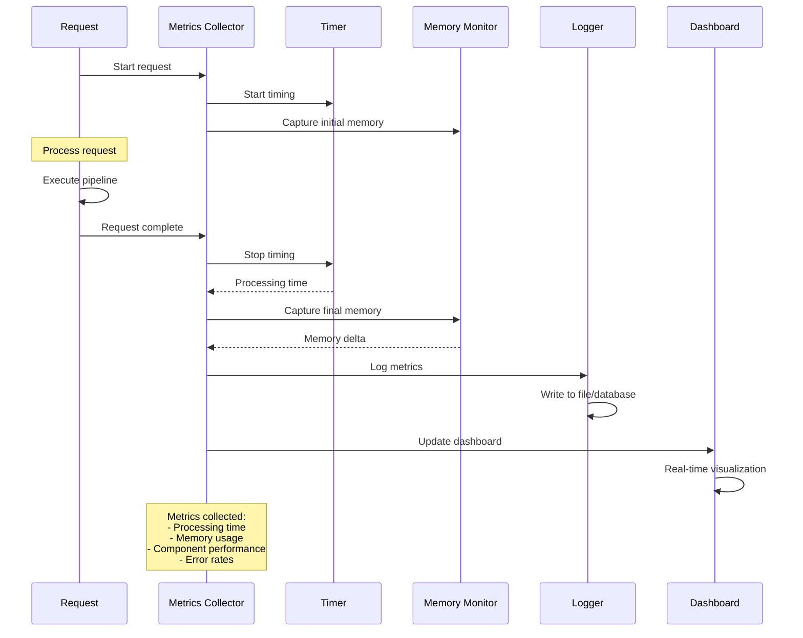

# 🌊 Data Flow Documentation

This document describes the data flow patterns, processing pipelines, and sequence diagrams for the RAG Second Brain system.

## 📊 Data Flow Overview

The system processes data through multiple interconnected pipelines, each handling different aspects of knowledge representation and retrieval.


---

## 🔄 Core Processing Pipelines

### 1. Document Indexing Pipeline

**Purpose:** Transform raw documents into searchable knowledge representations


**Data Transformations:**

1. **Text Preprocessing** (`src/utils/data_loader.py`)
   ```python
   Raw Text → Cleaned Text → Tokens → Normalized Forms
   
   "The iPhone by Apple Inc." 
   → "iphone apple inc"  
   → ["iphone", "apple", "inc"]
   → ["iphone", "apple_inc"]
   ```

2. **Co-occurrence Matrix** (`src/cooccurrence.py:47-78`)
   ```python
   Documents → Word Co-occurrences → PPMI Matrix
   
   Window size: 5 tokens
   Matrix dimensions: vocab_size × vocab_size
   Storage: Sparse CSR matrix (scipy.sparse)
   ```

3. **Dense Embeddings** (`src/dense_retrieval.py:33-52`) 
   ```python
   Documents → Embeddings → FAISS Index
   
   Model: sentence-transformers/all-MiniLM-L6-v2
   Dimension: 384
   Index type: IndexFlatIP (inner product)
   Normalization: L2 for cosine similarity
   ```

4. **Knowledge Graph** (`src/kg_retrieval.py:39-67`)
   ```python
   Documents → Entities → Graph Structure
   
   NER Model: spaCy en_core_web_sm
   Node types: PERSON, ORG, GPE, PRODUCT
   Edge weights: Co-occurrence frequency
   Storage: NetworkX Graph
   ```

5. **Ontology Processing** (`src/ontology.py:45-78`)
   ```python
   Structured Data → OWL Classes → Materialized Inferences
   
   Reasoner: Pellet (OWL 2 RL)
   Classes: Domain-specific concepts
   Properties: Relationships and attributes
   Inference: Materialized triples
   ```

### 2. Query Processing Pipeline

**Purpose:** Process user queries through all retrieval modalities


**Query Processing Steps:**

1. **Input Validation** (Web API layer)
   ```python
   {
       "query": "machine learning applications",
       "top_k": 10,
       "sources": ["dense", "cooccurrence", "kg", "ontology"]
   }
   ```

2. **Query Normalization** (`src/pipeline.py:98-105`)
   ```python
   "Machine Learning Applications" 
   → "machine learning applications"
   → ["machine", "learning", "applications"]
   ```

3. **Parallel Scoring** (`src/pipeline.py:82-86`)
   ```python
   # Concurrent execution across all sources
   cooccur_scores = self.cooccurrence.score_candidates(query, candidates)
   dense_scores = self.dense.retrieve(query, candidates) 
   kg_scores = self.kg.retrieve_with_reasoning(query, candidates)
   onto_scores = self.ontology.semantic_scoring(query, candidates)
   ```

4. **Dynamic Weighting** (`src/gating.py:83-89`)
   ```python
   query_embedding = encoder.encode(query)  # [384,]
   gate_weights = gating_network(query_embedding)  # [4,] summing to 1.0
   ```

5. **Score Fusion** (`src/pipeline.py:156-174`)
   ```python
   final_score = Σ(weight_i × score_i) for i in [cooccur, dense, kg, ontology]
   ```

### 3. Training Pipeline (Gating Network)

**Purpose:** Train the neural gating mechanism to optimize retrieval fusion


**Training Data Generation** (`src/gating.py:178-245`):

```python
def generate_training_data(queries, ground_truth):
    """
    Generate optimal gating weights for training.
    
    Process:
    1. For each query, compute retrieval scores from all sources
    2. Try different weight combinations (grid search)
    3. Evaluate performance (MAP, NDCG) for each combination
    4. Select weights that maximize performance
    5. Create (query → optimal_weights) training pairs
    """
    
    weight_grid = itertools.product(
        np.arange(0.0, 1.1, 0.1), repeat=4  # 4 sources
    )
    
    optimal_weights = []
    for query in queries:
        best_weights = None
        best_performance = 0.0
        
        for weights in weight_grid:
            if sum(weights) == 1.0:  # Normalized weights
                performance = evaluate_weights(query, weights)
                if performance > best_performance:
                    best_performance = performance
                    best_weights = weights
        
        optimal_weights.append(best_weights)
    
    return queries, optimal_weights
```

---

## 🔄 Specialized Data Flows

### Knowledge Graph Construction Flow

**Purpose:** Build entity relationship graph from document corpus


**Implementation Details** (`src/kg_retrieval.py:39-67`):

```python
def build_knowledge_graph(self, documents: List[str]) -> None:
    """Knowledge graph construction pipeline."""
    
    for doc_id, document in enumerate(tqdm(documents)):
        # Step 1: Entity extraction
        entities = self._extract_entities(document)
        
        # Step 2: Entity filtering and normalization
        filtered_entities = [
            self._normalize_entity(ent) 
            for ent in entities 
            if ent.label_ in ['PERSON', 'ORG', 'GPE', 'PRODUCT']
        ]
        
        # Step 3: Co-occurrence edge creation
        for i, entity1 in enumerate(filtered_entities):
            for entity2 in filtered_entities[i+1:]:
                weight = self._cooccurrence_weight(entity1, entity2, document)
                
                if weight > self.min_edge_weight:
                    self.graph.add_edge(entity1, entity2, weight=weight)
        
        # Step 4: Node feature computation
        for entity in filtered_entities:
            if entity not in self.entity_embeddings:
                embedding = self.encoder.encode([entity])
                self.entity_embeddings[entity] = embedding[0]
    
    # Step 5: Graph post-processing
    self._compute_graph_statistics()
    self._detect_communities()
    self.graph_built = True
```

### Ontology Reasoning Flow

**Purpose:** Materialize implicit knowledge through logical inference


**Reasoning Rules Implementation**:

```python
def _apply_reasoning_rules(self, ontology):
    """
    Apply OWL 2 RL reasoning rules.
    
    Rules implemented:
    1. Transitivity: If P(A,B) ∧ P(B,C) → P(A,C) for transitive P
    2. Subsumption: If A ⊆ B ∧ B ⊆ C → A ⊆ C  
    3. Property chains: If P ∘ Q ⊆ R then P(A,B) ∧ Q(B,C) → R(A,C)
    4. Domain/Range: If P has domain D then P(A,B) → D(A)
    """
    
    # Transitivity rules
    for prop in ontology.properties():
        if prop.is_transitive:
            self._materialize_transitive_closure(prop)
    
    # Subsumption hierarchy
    for cls in ontology.classes():
        for parent in cls.ancestors():
            self._add_subsumption_relation(cls, parent)
    
    # Property chain rules  
    for chain_axiom in ontology.property_chains():
        self._materialize_property_chain(chain_axiom)
```

---

## 🔀 Fusion and Ranking Flow

**Purpose:** Combine multiple retrieval scores into final rankings


**Fusion Algorithm Details** (`src/pipeline.py:156-174`):

```python
def _fuse_scores(self, score_lists: List[List[float]], 
                weights: torch.Tensor) -> List[float]:
    """
    Fuse multiple score lists using learned gating weights.
    
    Args:
        score_lists: [cooccur_scores, dense_scores, kg_scores, onto_scores]
        weights: Tensor of shape (4,) with normalized weights
        
    Returns:
        List of fused scores for each candidate
        
    Algorithm:
        final_score[i] = Σ(weight[j] × score_lists[j][i]) for j in sources
    """
    
    num_candidates = len(score_lists[0])
    final_scores = []
    
    for i in range(num_candidates):
        # Extract scores for candidate i from all sources
        candidate_scores = [score_list[i] for score_list in score_lists]
        
        # Weighted combination
        fused_score = sum(
            weight * score 
            for weight, score in zip(weights, candidate_scores)
        )
        
        final_scores.append(float(fused_score))
    
    return final_scores
```

**Alternative Fusion Methods** (`src/fusion/`):

1. **Reciprocal Rank Fusion** (`src/fusion/rrf.py`)
   ```python
   def reciprocal_rank_fusion(ranked_lists, k=60):
       """
       RRF(d) = Σ(1/(k + rank_i(d))) for all systems i
       
       Combines ranked lists without requiring score normalization.
       """
   ```

2. **Cross-Attention Fusion** (`src/fusion/cross_attention.py`)
   ```python
   def cross_attention_fusion(query_emb, score_vectors):
       """
       Learn attention weights over different retrieval sources
       based on query-source compatibility.
       """
   ```

---

## 📊 Performance and Monitoring Flow

**Purpose:** Track system performance and resource usage



**Metrics Collection** (distributed across modules):

```python
# Processing time tracking
@time_execution
def retrieve_and_rank(self, query: str, candidates: List[str]) -> List:
    start_time = time.time()
    
    # Component timing
    with Timer("cooccurrence"):
        cooccur_scores = self.cooccurrence.score_candidates(query, candidates)
    
    with Timer("dense_retrieval"):
        dense_scores = self.dense.retrieve(query, candidates)
    
    # ... other components
    
    total_time = time.time() - start_time
    logger.info(f"Pipeline completed in {total_time:.3f}s")
    
    return results

# Memory monitoring
def get_memory_usage():
    """Track memory usage across components."""
    return {
        'cooccurrence_matrix': sys.getsizeof(self.cooccurrence.ppmi_matrix),
        'dense_index': self.dense.index.ntotal * 4 * 384,  # 4 bytes per float
        'knowledge_graph': sys.getsizeof(self.kg.graph),
        'total_mb': psutil.Process().memory_info().rss / 1024 / 1024
    }
```

---

## 🌐 Web Application Data Flow

**Purpose:** Handle HTTP requests and provide web interface


**Flask Route Handlers** (`app/app.py`):

```python
@app.route('/search', methods=['POST'])
def search_endpoint():
    """Handle search requests with multi-modal retrieval."""
    
    # Request validation
    data = request.get_json()
    query = data.get('query', '')
    top_k = data.get('top_k', 10)
    sources = data.get('sources', ['dense', 'cooccurrence', 'kg', 'ontology'])
    
    # Pipeline execution
    start_time = time.time()
    results = pipeline.retrieve_and_rank(query, candidates, top_k)
    processing_time = (time.time() - start_time) * 1000  # Convert to ms
    
    # Response building
    response = {
        'status': 'success',
        'query': query,
        'results': [
            {
                'document': doc,
                'score': score,
                'source_scores': get_component_scores(doc),
                'gating_weights': get_gating_weights(query).tolist()
            }
            for doc, score in results
        ],
        'total_results': len(candidates),
        'processing_time_ms': int(processing_time)
    }
    
    return jsonify(response)
```

---

## 📈 Data Flow Performance Characteristics

### Throughput Metrics

| Component | Documents/sec | Queries/sec | Memory Usage |
|-----------|---------------|-------------|--------------|
| Co-occurrence | 50-100 | 20-40 | O(V²) sparse |
| Dense Retrieval | 100-200 | 100-200 | O(n×d) dense |
| Knowledge Graph | 10-50 | 5-15 | O(V+E) graph |
| Ontology Reasoning | 5-20 | 2-10 | O(axioms) |
| **Pipeline Total** | **10-20** | **2-10** | **~1-2GB** |

### Latency Breakdown


### Scalability Patterns

1. **Horizontal Scaling**
   - FAISS index sharding across multiple nodes
   - Knowledge graph partitioning by entity types
   - Load balancing across retrieval components

2. **Vertical Scaling**
   - GPU acceleration for neural components
   - Memory optimization for sparse matrices
   - Caching frequently accessed data

3. **Asynchronous Processing**
   - Background index updates
   - Batch processing for training data
   - WebSocket real-time updates

---

**Next:** [⚙️ Setup Guide](SETUP.md) | **Previous:** [🔌 API Reference](API_REFERENCE.md)