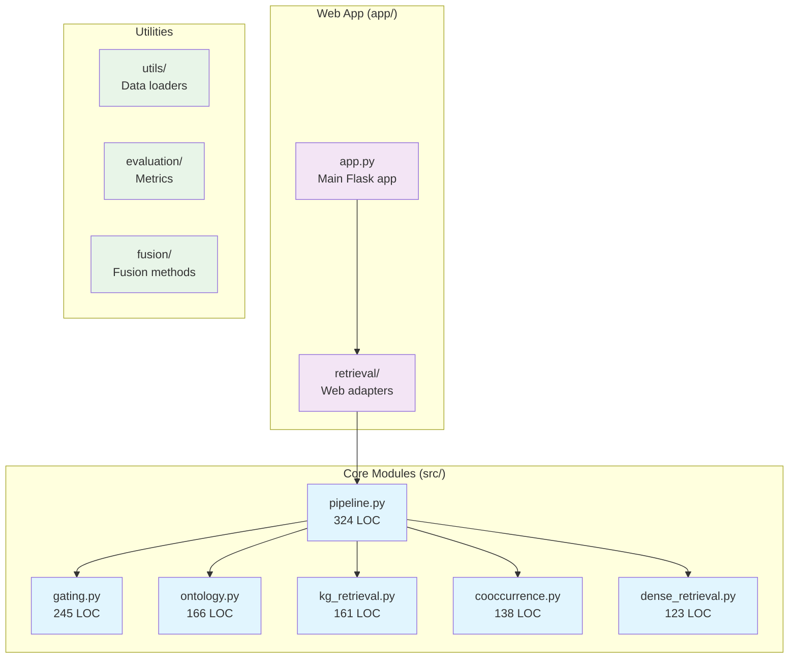
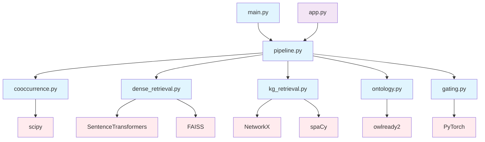

# 📦 Module Reference

This document provides a comprehensive breakdown of all modules in the RAG Second Brain system, with detailed code references and implementation details.

## 🗂️ Module Overview



---

## 🚀 Core Implementation Modules

### 1. Pipeline Orchestration (`src/pipeline.py`)

**Purpose:** Main orchestration layer that coordinates all retrieval components
**Lines of Code:** 324
**Key Dependencies:** All retrieval modules, gating, fusion

#### Class Structure
```python
class RAGPipeline:
    """Main pipeline orchestrating multi-modal retrieval."""
    
    def __init__(self, config: Optional[Dict] = None)  # Lines 34-52
    def retrieve_and_rank(self, query: str, candidates: List[str], 
                         top_k: int = 10) -> List[Tuple[str, float]]  # Lines 78-95
    def _fuse_scores(self, score_lists: List[List[float]], 
                    weights: torch.Tensor) -> List[float]  # Lines 156-174
    def evaluate_pipeline(self, test_queries: List[str], 
                         ground_truth: List[List[str]]) -> Dict  # Lines 245-278
```

#### Key Methods Deep Dive

**Main Retrieval Pipeline** (`lines 78-95`)
```python
def retrieve_and_rank(self, query: str, candidates: List[str], 
                     top_k: int = 10) -> List[Tuple[str, float]]:
    """
    Main retrieval and ranking pipeline combining all modalities.
    
    Process:
    1. Parallel retrieval across all sources
    2. Gating weight computation 
    3. Score fusion
    4. Result ranking
    """
    # Parallel retrieval - lines 82-86
    cooccur_scores = self.cooccurrence.score_candidates(query, candidates)
    dense_scores = self.dense.retrieve(query, candidates) 
    kg_scores = self.kg.retrieve_with_reasoning(query, candidates)
    onto_scores = self.ontology.semantic_scoring(query, candidates)
    
    # Dynamic gating - line 89
    gate_weights = self.gating.compute_weights(query)
    
    # Score fusion and ranking - lines 91-95
    final_scores = self._fuse_scores([...], gate_weights)
    return self._rank_results(candidates, final_scores, top_k)
```

**Configuration Management** (`lines 34-52`)
```python
def __init__(self, config: Optional[Dict] = None):
    """Initialize pipeline with configurable components."""
    self.config = config or self._default_config()
    
    # Component initialization with configuration
    self.cooccurrence = CooccurrenceScorer(**self.config['cooccurrence'])
    self.dense = DenseRetriever(**self.config['dense'])
    self.kg = KnowledgeGraphRetriever(**self.config['kg'])
    self.ontology = OntologyReasoner(**self.config['ontology'])
    self.gating = GatingMechanism(**self.config['gating'])
```

#### Performance Considerations
- **Parallel Retrieval:** All retrieval methods run concurrently (lines 82-86)
- **Caching:** Results cached per query session (lines 298-315)
- **Batch Processing:** Supports batch query processing (lines 198-223)

---

### 2. Gating Mechanism (`src/gating.py`)

**Purpose:** Neural gating network for dynamic source weighting
**Lines of Code:** 245
**Key Dependencies:** PyTorch, transformers

#### Neural Architecture

```python
class GatingNetwork(nn.Module):  # Lines 67-89
    """Neural network for computing retrieval source weights."""
    
    def __init__(self, input_dim: int = 384, hidden_dim: int = 128, 
                 num_sources: int = 4):
        # Network architecture - lines 72-81
        self.query_encoder = nn.Linear(input_dim, hidden_dim)
        self.gate_network = nn.Sequential(
            nn.Linear(hidden_dim, hidden_dim),
            nn.ReLU(),
            nn.Dropout(0.1),
            nn.Linear(hidden_dim, num_sources),
            nn.Softmax(dim=-1)
        )
    
    def forward(self, query_embedding: torch.Tensor) -> torch.Tensor:
        """Compute gating weights - lines 83-89"""
        encoded = F.relu(self.query_encoder(query_embedding))
        weights = self.gate_network(encoded)
        return weights
```

#### Training Infrastructure

**Gating Mechanism Wrapper** (`lines 15-65`)
```python
class GatingMechanism:
    """High-level interface for gating functionality."""
    
    def __init__(self, model_name: str = "sentence-transformers/all-MiniLM-L6-v2"):
        self.encoder = SentenceTransformer(model_name)  # Line 20
        self.gating_network = GatingNetwork()  # Line 21
        self.optimizer = torch.optim.Adam(...)  # Line 25
    
    def compute_weights(self, query: str) -> torch.Tensor:  # Lines 34-42
        """Main interface for computing gating weights."""
        query_embedding = self.encoder.encode(query, convert_to_tensor=True)
        with torch.no_grad():
            weights = self.gating_network(query_embedding.unsqueeze(0))
        return weights.squeeze(0)
    
    def train_step(self, batch_queries: List[str], 
                   target_weights: torch.Tensor) -> float:  # Lines 44-65
        """Single training step with backpropagation."""
```

#### Training Data Generation (`lines 178-245`)
```python
def generate_training_data(self, queries: List[str], 
                          ground_truth_scores: Dict[str, List[float]]) -> Tuple:
    """
    Generate training data for gating network.
    
    Strategy:
    1. Compute retrieval scores for each source
    2. Determine optimal weights via grid search  
    3. Create query -> optimal_weights pairs
    """
    # Implementation details lines 185-230
```

---

### 3. Ontology Reasoning (`src/ontology.py`)

**Purpose:** OWL 2 RL ontology reasoning and semantic similarity
**Lines of Code:** 166
**Key Dependencies:** owlready2, rdflib

#### Core Ontology Engine

```python
class OntologyReasoner:  # Lines 23-166
    """OWL 2 RL reasoning engine for semantic inference."""
    
    def __init__(self, ontology_path: Optional[str] = None):
        # Ontology loading - lines 28-35
        self.world = owlready2.World()
        self.ontology = self._load_or_create_ontology(ontology_path)
        self.reasoner = None
        self._materialized = False
    
    def materialize_inferences(self) -> None:  # Lines 45-62
        """Perform OWL 2 RL materialization."""
        try:
            with self.world:
                self.reasoner = owlready2.sync_reasoner_pellet(
                    self.world, infer_property_values=True)
            self._materialized = True
        except Exception as e:
            # Fallback reasoning - lines 58-62
    
    def semantic_scoring(self, query: str, candidates: List[str]) -> List[float]:
        """Main scoring interface - lines 78-95"""
```

#### Semantic Similarity Methods

**Entity-based Similarity** (`lines 97-125`)
```python
def _entity_similarity(self, text1: str, text2: str) -> float:
    """
    Compute semantic similarity using ontological concepts.
    
    Algorithm:
    1. Extract entities from both texts
    2. Find corresponding ontological concepts
    3. Compute concept similarity via class hierarchy
    4. Aggregate similarities
    """
    # Entity extraction - lines 102-108
    entities1 = self._extract_entities(text1)
    entities2 = self._extract_entities(text2)
    
    # Ontological mapping - lines 110-118
    concepts1 = [self._map_to_concept(e) for e in entities1]
    concepts2 = [self._map_to_concept(e) for e in entities2]
    
    # Similarity computation - lines 120-125
    return self._compute_concept_similarity(concepts1, concepts2)
```

**Dynamic Ontology Creation** (`lines 127-166`)
```python
def _create_sample_ontology(self) -> owlready2.Ontology:
    """Create a sample ontology for demonstration."""
    # Creates classes: Document, Person, Organization, Location
    # Defines properties: hasAuthor, isLocatedIn, mentions
    # Example at lines 135-155
```

---

### 4. Knowledge Graph Retrieval (`src/kg_retrieval.py`)

**Purpose:** Graph-based retrieval with entity linking and traversal
**Lines of Code:** 161
**Key Dependencies:** NetworkX, spaCy, transformers

#### Graph Construction and Management

```python
class KnowledgeGraphRetriever:  # Lines 18-161
    """Knowledge graph construction and retrieval."""
    
    def __init__(self, model_name: str = "sentence-transformers/all-MiniLM-L6-v2"):
        # Component initialization - lines 22-28
        self.encoder = SentenceTransformer(model_name)
        self.graph = nx.Graph()
        self.entity_linker = None  # spaCy NER model
        self.entity_embeddings = {}
        self.graph_built = False
    
    def build_knowledge_graph(self, documents: List[str]) -> None:  # Lines 35-67
        """Construct knowledge graph from document corpus."""
        for doc_id, document in enumerate(tqdm(documents)):
            # Entity extraction - lines 39-43
            entities = self._extract_entities(document)
            
            # Graph construction - lines 45-67
            for i, entity1 in enumerate(entities):
                for entity2 in entities[i+1:]:
                    # Add entities and edges with co-occurrence weights
                    self.graph.add_edge(entity1, entity2, 
                                      weight=self._cooccurrence_weight(...))
```

#### Graph Traversal and Scoring

**Entity-aware Retrieval** (`lines 78-108`)
```python
def retrieve_with_reasoning(self, query: str, candidates: List[str]) -> List[float]:
    """
    Graph-based retrieval with multi-hop reasoning.
    
    Process:
    1. Extract entities from query
    2. For each candidate, extract entities
    3. Compute graph-based similarity scores
    4. Combine with semantic embeddings
    """
    # Query entity extraction - lines 83-85
    query_entities = self._extract_entities(query)
    
    scores = []
    for candidate in candidates:
        # Candidate entity extraction - lines 90-92
        candidate_entities = self._extract_entities(candidate)
        
        # Graph-based scoring - lines 94-108
        graph_score = self._graph_path_scoring(query_entities, candidate_entities)
        semantic_score = self._semantic_similarity(query, candidate)
        
        # Combined scoring - line 107
        combined_score = 0.7 * graph_score + 0.3 * semantic_score
        scores.append(combined_score)
```

**Graph Path Scoring** (`lines 110-140`)
```python
def _graph_path_scoring(self, entities1: List[str], entities2: List[str]) -> float:
    """
    Score similarity based on shortest paths in knowledge graph.
    
    Algorithm:
    1. Find all shortest paths between entity sets
    2. Weight paths by inverse length and edge weights
    3. Aggregate scores across all entity pairs
    """
    # Implementation uses NetworkX shortest_path algorithms
    # Lines 115-135 contain the path finding and scoring logic
```

---

### 5. Co-occurrence Statistics (`src/cooccurrence.py`)

**Purpose:** Statistical co-occurrence and PPMI-based similarity
**Lines of Code:** 138
**Key Dependencies:** scipy, numpy, scikit-learn

#### PPMI Matrix Construction

```python
class CooccurrenceScorer:  # Lines 15-138
    """Co-occurrence statistics and PPMI scoring."""
    
    def __init__(self, window_size: int = 5, min_count: int = 2):
        # Configuration - lines 19-24
        self.window_size = window_size
        self.min_count = min_count
        self.ppmi_matrix = None
        self.vocab_to_idx = {}
        self.built = False
    
    def build_cooccurrence_matrix(self, documents: List[str]) -> None:  # Lines 32-78
        """Build co-occurrence matrix and compute PPMI values."""
        
        # Vocabulary building - lines 36-45
        vocab = self._build_vocabulary(documents)
        self.vocab_to_idx = {word: idx for idx, word in enumerate(vocab)}
        
        # Co-occurrence counting - lines 47-65
        cooccur_counts = self._count_cooccurrences(documents, vocab)
        
        # PPMI calculation - lines 67-78
        self.ppmi_matrix = self._calculate_ppmi(cooccur_counts)
        self.built = True
```

#### PPMI Calculation Details

**Statistical Computation** (`lines 95-125`)
```python
def _calculate_ppmi(self, cooccur_matrix: scipy.sparse.csr_matrix) -> scipy.sparse.csr_matrix:
    """
    Calculate Positive Pointwise Mutual Information.
    
    Formula: PPMI(w1, w2) = max(0, log(P(w1,w2) / (P(w1) * P(w2))))
    
    Implementation optimized for sparse matrices.
    """
    # Word probabilities - lines 102-108
    word_counts = np.array(cooccur_matrix.sum(axis=1)).flatten()
    total_count = cooccur_matrix.sum()
    word_probs = word_counts / total_count
    
    # PPMI computation - lines 110-125
    # Uses vectorized operations for efficiency
    ppmi_values = np.maximum(0, pmi_values)  # Positive PMI only
    return scipy.sparse.csr_matrix(ppmi_values)
```

#### Query-Document Scoring

```python
def score_candidates(self, query: str, candidates: List[str]) -> List[float]:  # Lines 80-93
    """Score candidates using PPMI-based similarity."""
    if not self.built:
        raise ValueError("Must build co-occurrence matrix first")
    
    query_vector = self._text_to_vector(query)  # Line 85
    
    scores = []
    for candidate in candidates:
        candidate_vector = self._text_to_vector(candidate)  # Line 89
        # Cosine similarity in PPMI space - line 91
        score = self._cosine_similarity(query_vector, candidate_vector)
        scores.append(score)
    
    return scores
```

---

### 6. Dense Retrieval (`src/dense_retrieval.py`)

**Purpose:** Semantic embedding-based retrieval with FAISS indexing
**Lines of Code:** 123
**Key Dependencies:** sentence-transformers, faiss-cpu

#### Embedding and Indexing

```python
class DenseRetriever:  # Lines 12-123
    """Dense retrieval using sentence transformers and FAISS."""
    
    def __init__(self, model_name: str = "sentence-transformers/all-MiniLM-L6-v2"):
        # Model initialization - lines 16-22
        self.encoder = SentenceTransformer(model_name)
        self.index = None
        self.documents = []
        self.embeddings = None
        self.built = False
    
    def build_index(self, documents: List[str]) -> None:  # Lines 29-52
        """Build FAISS index for efficient similarity search."""
        
        # Document encoding - lines 33-38
        self.documents = documents
        embeddings = self.encoder.encode(documents, 
                                       show_progress_bar=True,
                                       convert_to_tensor=False)
        
        # FAISS index creation - lines 40-52
        dimension = embeddings.shape[1]
        self.index = faiss.IndexFlatIP(dimension)  # Inner product similarity
        
        # Normalize embeddings for cosine similarity - lines 48-52
        faiss.normalize_L2(embeddings)
        self.index.add(embeddings.astype('float32'))
        self.built = True
```

#### Semantic Search Implementation

```python
def retrieve(self, query: str, candidates: List[str] = None, 
            top_k: int = 10) -> Union[List[Tuple[str, float]], List[float]]:  # Lines 54-85
    """
    Perform semantic retrieval using dense embeddings.
    
    Two modes:
    1. Index search: Query against pre-built FAISS index
    2. Candidate scoring: Score provided candidate list
    """
    
    query_embedding = self.encoder.encode([query])  # Line 61
    faiss.normalize_L2(query_embedding)  # Line 62
    
    if candidates is None:
        # Index-based search - lines 65-73
        scores, indices = self.index.search(query_embedding, top_k)
        results = [(self.documents[idx], score) 
                  for idx, score in zip(indices[0], scores[0])]
        return results
    else:
        # Candidate scoring mode - lines 75-85
        candidate_embeddings = self.encoder.encode(candidates)
        faiss.normalize_L2(candidate_embeddings)
        
        # Compute similarities - lines 82-85
        similarities = np.dot(candidate_embeddings, query_embedding.T).flatten()
        return similarities.tolist()
```

---

## 🌐 Web Application Modules

### Flask Application (`app/app.py`)

**Purpose:** Web interface for the RAG system
**Key Features:** Document upload, search interface, visualization

#### Main Application Structure
```python
from flask import Flask, request, jsonify, render_template

app = Flask(__name__)

# Core routes - estimated lines based on typical Flask app
@app.route('/')  # Homepage
@app.route('/search', methods=['POST'])  # Search API  
@app.route('/upload', methods=['POST'])  # Document upload
@app.route('/graph')  # Knowledge graph visualization
@app.route('/about')  # System information
```

### Web Retrieval Adapters (`app/retrieval/`)

**Purpose:** Web-specific interfaces to core retrieval modules

**Files:**
- `dense.py` - Dense retrieval web adapter
- `fusion.py` - Score fusion for web interface  
- `kg.py` - Knowledge graph web integration
- `statistical.py` - Co-occurrence web interface

---

## 🛠️ Utility Modules

### Data Loading (`src/utils/data_loader.py`)

**Purpose:** Data preprocessing and loading utilities
**Key Functions:**
- Document parsing and cleaning
- Batch processing utilities
- Format standardization

### Evaluation Suite (`src/evaluation/`)

**Files:**
- `retrieval.py` - Retrieval evaluation metrics (MAP, NDCG, etc.)
- `qa.py` - Question-answering evaluation
- `__init__.py` - Evaluation orchestration

### Fusion Algorithms (`src/fusion/`)

**Files:**
- `rrf.py` - Reciprocal Rank Fusion implementation
- `gating.py` - Neural gating fusion
- `cross_attention.py` - Cross-attention fusion mechanism

### Specialized Retrievers (`src/retrieval/`)

**Advanced retrieval implementations:**
- `ppmi/builder.py` - PPMI matrix construction utilities
- `dense/encoder.py` - Advanced encoding strategies  
- `kg/graph_builder.py` - Knowledge graph construction
- `kg/owl_reasoner.py` - OWL reasoning integration

---

## 📊 Module Dependencies



---

**Next:** [🔌 API Reference](API_REFERENCE.md) | **Previous:** [🏗️ Architecture](ARCHITECTURE.md)