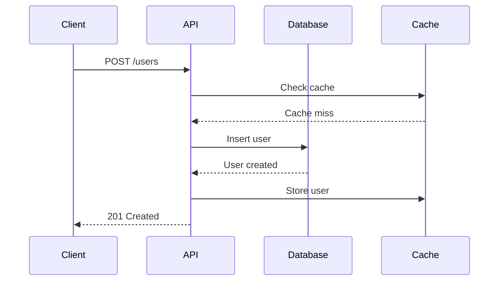

# User Guides & Tutorials

## Tutorial Structure

### Progressive Learning Path

```markdown
# Getting Started with API

## Prerequisites
Before you begin, ensure you have:
- [ ] Node.js 18+ installed
- [ ] An API key from your dashboard
- [ ] Basic knowledge of REST APIs

## Quick Start (5 minutes)

### 1. Install the SDK
```bash
npm install @myapi/sdk
```

### 2. Create Your First Request
```typescript
import { Client } from '@myapi/sdk';

const client = new Client({ apiKey: 'your_key' });
const users = await client.users.list();
console.log(users);
```

### 3. Verify It Works
Run the code and you should see a list of users.

**Expected output:**
```json
{
  "data": [
    { "id": "1", "name": "Alice" },
    { "id": "2", "name": "Bob" }
  ],
  "total": 2
}
```

## Next Steps
- [Authentication Guide](/docs/auth) - Learn about OAuth and API keys
- [Advanced Queries](/docs/queries) - Filtering, sorting, pagination
- [Error Handling](/docs/errors) - Handle errors gracefully
```

### Step-by-Step Tutorial

```markdown
# Tutorial: Building a User Dashboard

**What you'll learn:**
- Fetching user data from the API
- Handling pagination
- Displaying data in a table
- Adding real-time updates

**Time:** 30 minutes
**Level:** Intermediate

## Step 1: Set Up the Project

Create a new project:
```bash
mkdir user-dashboard
cd user-dashboard
npm init -y
npm install @myapi/sdk react
```

## Step 2: Fetch Users

Create `src/api/users.ts`:
```typescript
import { Client } from '@myapi/sdk';

const client = new Client({ apiKey: process.env.API_KEY });

export async function getUsers(page = 1, limit = 20) {
  const response = await client.users.list({ page, limit });
  return response;
}
```

**What's happening:**
1. We import the SDK client
2. Initialize it with our API key from environment
3. Create a helper function that fetches paginated users

## Checkpoint
At this point, you have:
- [x] Set up the SDK
- [x] Created an API helper
- [x] Built a user table component
- [ ] Added pagination
- [ ] Added real-time updates
```

## Information Architecture

### Content Hierarchy

```
Documentation/
├── Getting Started/
│   ├── Quick Start (5 min)
│   ├── Installation
│   ├── Authentication
│   └── First Request
│
├── Guides/
│   ├── User Management
│   ├── File Uploads
│   ├── Webhooks
│   └── Rate Limiting
│
├── API Reference/
│   ├── Users API
│   ├── Files API
│   └── Webhooks API
│
├── SDK Documentation/
│   ├── Python SDK
│   ├── TypeScript SDK
│   └── Go SDK
│
├── Tutorials/
│   ├── Build a Dashboard (30 min)
│   ├── Integrate Authentication (45 min)
│   └── Real-time Sync (60 min)
│
└── Resources/
    ├── Troubleshooting
    ├── FAQ
    ├── Best Practices
    └── Migration Guides
```

## Writing Techniques

### Task-Based Writing

```markdown
# How to Upload a File

**Goal:** Upload an image file to your account storage
**Time:** 5 minutes

## Steps

### 1. Prepare the file
Get the file from user input or file system:
```typescript
const file = document.querySelector('input[type="file"]').files[0];
```

### 2. Create form data
```typescript
const formData = new FormData();
formData.append('file', file);
formData.append('folder', 'avatars');
```

### 3. Upload with the SDK
```typescript
const result = await client.files.upload(formData);
console.log('File URL:', result.url);
```

## Common Issues

**"File too large" error:**
Maximum file size is 10MB. Compress images before uploading.

**"Invalid file type" error:**
Only .jpg, .png, .gif are allowed. Check the file extension.
```

### Progressive Disclosure

Use `<details>` tags for advanced content that shouldn't overwhelm beginners.

## Visual Communication

### Diagram Integration (Mermaid)

```markdown
## Request Flow


```

## Troubleshooting Guides

### Problem-Solution Format

```markdown
# Troubleshooting

## Authentication Errors

### "Invalid API key"

**Symptoms:**
- 401 Unauthorized error
- Error message: "Invalid API key"

**Causes:**
1. API key was copied incorrectly (extra spaces)
2. API key was revoked
3. Using test key in production environment

**Solutions:**

**1. Verify the key:**
```bash
echo -n "$API_KEY" | wc -c  # Should be exactly 32 characters
```

**2. Regenerate the key:**
- Go to dashboard
- Click "Revoke & Regenerate"
- Update your environment variables

**Still not working?**
Contact support with your request ID from the error response.
```

## FAQ Section Template

```markdown
# Frequently Asked Questions

## General

### What's included in the free tier?
- 1,000 API requests/month
- 1GB storage
- Community support

### How do I upgrade?
Click "Upgrade" in your dashboard and select a plan.

## Technical

### What's the rate limit?
- Free: 10 requests/minute
- Pro: 100 requests/minute
- Enterprise: Custom limits

---

**Can't find your answer?**
- [Browse all docs](/docs)
- [Ask the community](https://community.example.com)
- [Contact support](/support)
```

## Quick Reference

| Content Type | Best For | Key Elements |
|-------------|----------|-------------|
| Quick Start | New users (5 min) | Prerequisites, minimal code, verify |
| Tutorial | Learning by doing | Steps, checkpoints, working code |
| How-To Guide | Specific tasks | Goal, steps, troubleshooting |
| Reference | Looking up details | Comprehensive, searchable |
| Explanation | Understanding concepts | Why, not how |

| Writing Principle | Technique |
|------------------|-----------|
| Clarity | Active voice, short sentences |
| Scannability | Headings, lists, code blocks |
| Completeness | Prerequisites, next steps, related links |
| Accuracy | Test all code, version specifics |
